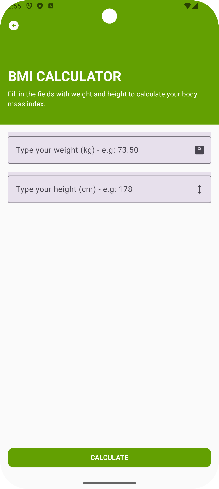
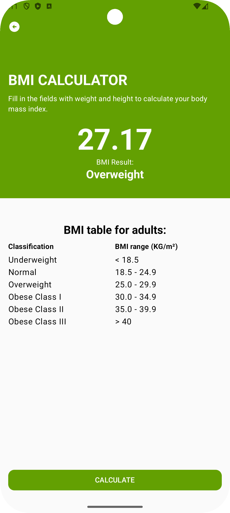
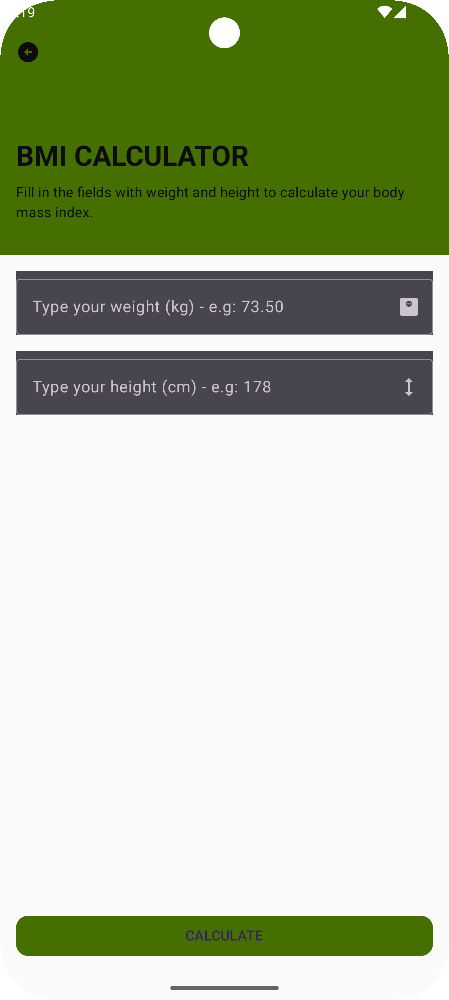
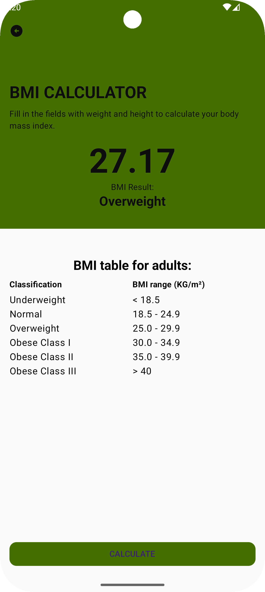

# BMI Calculator App

A simple **BMI (Body Mass Index) Calculator** developed using **Jetpack Compose** for Android. The app supports both **Light and Dark themes**, providing a modern and responsive UI experience.

## 📱 Features

- **Simple BMI Calculation**: Input your weight and height to quickly calculate your BMI.
- **Dynamic UI**: Built using **Jetpack Compose**, ensuring a smooth and intuitive user experience.
- **Dark & Light Modes**: Automatically adapts to the system's dark or light theme settings.
- **Snackbars for Validation**: Displays error messages if input fields are left empty.
- **Material Design 3**: Styled with the latest Material Design components.

## 🛠️ Technologies Used

- **Kotlin**
- **Jetpack Compose**
- **Material Design 3**
- **Android Architecture Components**

## 🚀 Getting Started

### Prerequisites

- Android Studio (Flamingo or later)
- Android SDK 33+
- Kotlin 1.8+

### Installation

1. Clone the repository:
   ```bash
   git clone https://github.com/yourusername/bmi-calculator.git
   ```
2. Open the project in **Android Studio**.
3. Build and run the app on an emulator or physical device.

## 📷 Screenshots

| Image 01                                | Image 02                                | Image 03                                | Image 04                                |
|-----------------------------------------|-----------------------------------------|-----------------------------------------|-----------------------------------------|
|  |  |  |  |

## ✨ Usage

1. Enter your **weight** in kilograms (e.g., 70.5).
2. Enter your **height** in centimeters (e.g., 180).
3. Click the **CALCULATE** button.
4. View your BMI result and classification.

## 🤝 Contributing

Contributions are welcome! Feel free to open issues or submit pull requests.

## 📄 License

Copyright 2025 Daniel Vilha

Permission is hereby granted, free of charge, to any person obtaining a copy of this software and associated documentation files (the “Software”), to deal in the Software without restriction, including without limitation the rights to use, copy, modify, merge, publish, distribute, sublicense, and/or sell copies of the Software, and to permit persons to whom the Software is furnished to do so, subject to the following conditions:

The above copyright notice and this permission notice shall be included in all copies or substantial portions of the Software.

THE SOFTWARE IS PROVIDED “AS IS”, WITHOUT WARRANTY OF ANY KIND, EXPRESS OR IMPLIED, INCLUDING BUT NOT LIMITED TO THE WARRANTIES OF MERCHANTABILITY, FITNESS FOR A PARTICULAR PURPOSE AND NONINFRINGEMENT. IN NO EVENT SHALL THE AUTHORS OR COPYRIGHT HOLDERS BE LIABLE FOR ANY CLAIM, DAMAGES OR OTHER LIABILITY, WHETHER IN AN ACTION OF CONTRACT, TORT OR OTHERWISE, ARISING FROM, OUT OF OR IN CONNECTION WITH THE SOFTWARE OR THE USE OR OTHER DEALINGS IN THE SOFTWARE.

---

Made with ❤️ using **Jetpack Compose**.